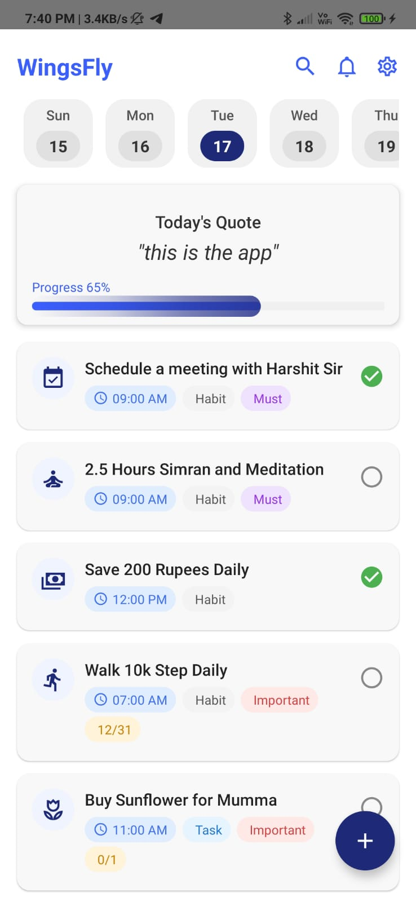
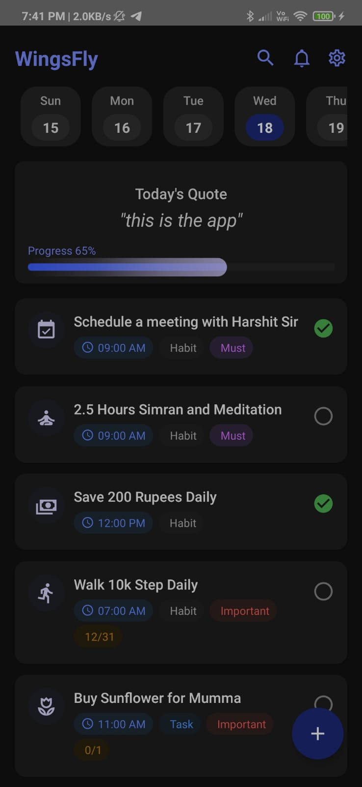
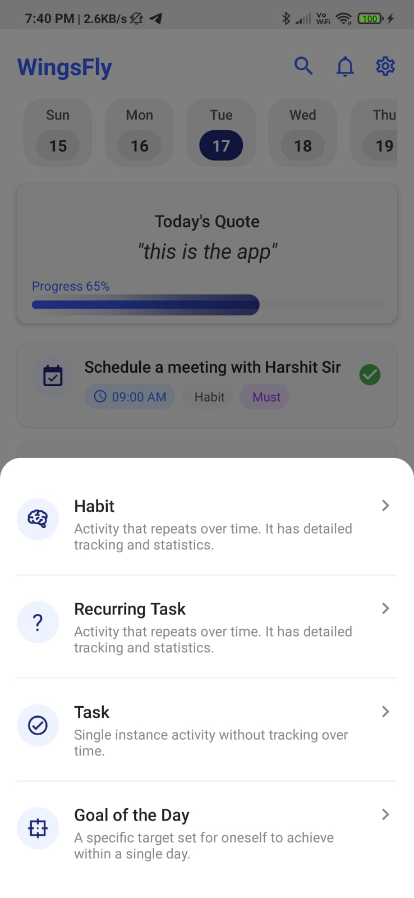
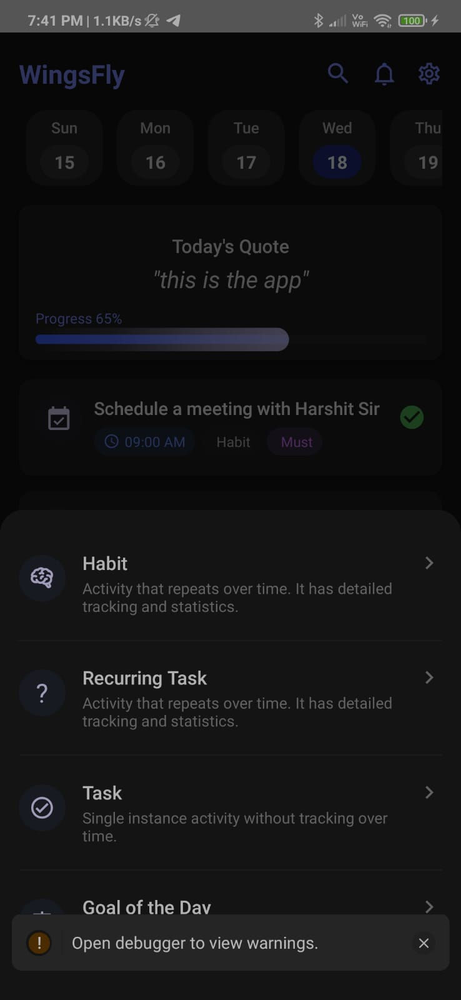

# 🛠️ WingsFly UI Clone – Fresher React Native Assignment

A clean, modular React Native CLI project that recreates the given Figma-based home screen UI with animations, dark mode, and modular components.

---

## 📸 Screenshots

| Light Mode | Dark Mode |
|------------|-----------|
|  |  |
|  |  |

---

## 🚀 Setup Instructions

### Prerequisites

- Node.js ≥ 14.x  
- React Native CLI (not Expo)  
- Android Studio or Xcode for device simulation  
- TypeScript support

### 1. Clone the Repository

```bash
git clone https://github.com/yourusername/wingsfly-ui-clone.git
cd wingsfly-ui-clone
```

### 2. Install Dependencies

```bash
npm install
# or
yarn install
```

### 3. Run the App

```bash
npx react-native run-android
# or
npx react-native run-ios
```

### 4. Configure Android Permissions (Optional for file/modal features)

Edit `android/app/src/main/AndroidManifest.xml`:

```xml
<uses-permission android:name="android.permission.WRITE_EXTERNAL_STORAGE"/>
<uses-permission android:name="android.permission.READ_EXTERNAL_STORAGE"/>
```

For Android 11+, inside `<application>` tag:

```xml
android:requestLegacyExternalStorage="true"
```

---

## 📁 Folder Structure

```
wingsfly-ui-clone/
├── components/
│   ├── DateButton.tsx
│   ├── ProgressBar.tsx
│   ├── TaskItem.tsx
│   ├── FloatingActionButton.tsx
│   └── BottomDrawerModal.tsx
├── screens/
│   └── HomeScreen.tsx
├── types/
│   └── Task.ts
├── utils/
│   └── constants.ts
├── screenshots/
│   ├── light_home.jpeg
│   ├── dark_home.jpeg
│   ├── light_modal.jpeg
│   └── dark_modal.jpeg
└── App.tsx
```

---

## 🔧 Key Features

- Accurate UI recreation from Figma
- Modular code architecture
- Bottom Drawer modal with slide-up animation using `react-native-reanimated`
- Light and Dark mode support
- Responsive layout
- Reusable components

---

## 🙋 Author

**Saurav Singh Negi**  
GitHub: [@saurav1301](https://github.com/saurav1301)

---

## 📄 License

This project is intended for assignment/demo purposes only.
